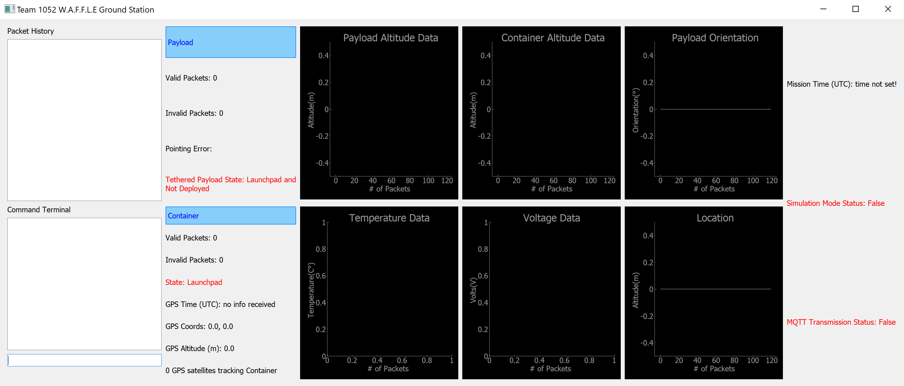

# Cansat-2022
Software for CanSat Team 1052 W.A.F.F.L.E
# TODO
- Complete Flight Software and update GCS software for 2022 Cansat requirements\

GCS xbee can just use AT mode since it only communicates with container, but container need to be in API mode
- add support for more states in GCS

# GCS
## Ground Control Software Local Test Suite
The values generated by the Local Test Suite aren't at all realistic, it just gives us a way to confirm our widgets are updating

## GCS Screenshot


## Ground Control Software Build Instructions

### Windows
```bat
:: Create virtual environment
$ python -m venv venv

:: Start virtual environment
$ call venv/scripts/activate.bat

:: Install required packages
$ pip install -r requirements.txt

:: Run the GCS
$ python main.py

:: Alternatively, run the GCS with option -t to initiate a local test
$ python main.py -t

:: Leave the virtual environment
$ deactivate
```

### Linux
```bash
# Create virtual environment
$ python3 -m venv venv

# Start virtual environment
$ source venv/bin/activate

# Install requried packages
$ pip install -r requirements.txt

# Run the GCS
$ python3 main.py

# Alternatively, run the GCS with option -t to initiate a local test
$ python3 main.py -t

# Leave the virtual environment
$ deactivate
```
## License
Copyright (c) 2022 CanSat Team 1052 W.A.F.F.L.E

Licensed under the [MIT license](LICENSE)
